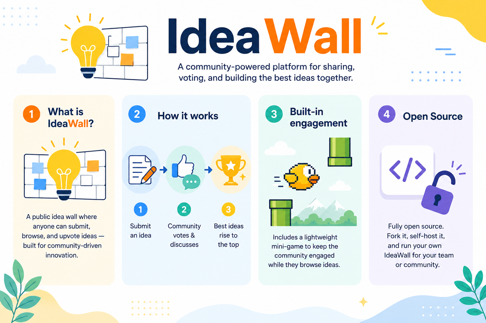

<p align="center">
  
</p>

# 💡 Idea Wall Antarestar

**A social idea board that makes your team's suggestion box actually work.**

Idea Wall turns the dusty, ignored "suggestion box" into a living social feed. Employees post improvement ideas (with photos), react and comment on each other's, earn points on a contributor leaderboard, vote for Employee of the Month, and watch it all scroll live on an office TV. It's an **employee engagement + continuous-improvement platform** you can self-host in minutes.

Built by [Antarestar](https://antarestar.com) for its own team, battle-tested with ~150 daily users, and open-sourced so any company can run its own.

> **Stack:** Node.js + Express, plain JSON-file storage, Server-Sent Events for realtime. No database, no build step, no front-end framework. One `npm start` and it's live.

---

## 🎯 The problem it solves

Most companies "collect ideas" through a physical box, a Google Form, or a WhatsApp group. All three fail the same way:

- **Ideas disappear.** Nobody sees them, nobody knows what happened to theirs, so people stop bothering.
- **No feedback loop.** A submitter never learns if their idea was read, rejected, or shipped.
- **No recognition.** The person who saved the company money gets nothing — not even a "thanks."
- **No visibility for leadership.** Management can't see themes, momentum, or who's contributing.

Idea Wall fixes all four by making ideas **public, social, trackable, and rewarded** — the same mechanics that make social media addictive, pointed at making your company better.

---

## 🏢 What companies use it for

| Use case | How Idea Wall helps |
|----------|---------------------|
| **Continuous improvement / Kaizen** | A single place to capture operational fixes from the floor, tag their status (Pending → In Progress → Done), and showcase what shipped. |
| **Employee engagement** | Likes, comments, points, and a leaderboard turn "giving feedback" into something people *want* to do. |
| **Employee recognition** | Built-in **Employee of the Month** voting with company core values, live results, and a Hall of Champions. |
| **Innovation / R&D intake** | Collect product/process ideas, spot recurring themes, and prioritize with the admin analytics dashboard. |
| **Internal comms / town halls** | The **TV dashboard** turns idle office screens into a live wall of ideas and wins — great for lobbies, cafeterias, and all-hands. |
| **HR culture programs** | Categories like "Sports Day" and seasonal campaigns run alongside work ideas to build community. |
| **Leadership insight** | The admin dashboard surfaces categories, status breakdowns, trends over time, top contributors, and a word cloud — a pulse on what the team cares about. |
| **Onboarding & belonging** | New hires post their first idea on day one and instantly feel heard. |

It works for a 10-person studio or a 1,000-person factory — anywhere people have ideas and deserve to be heard.

---

## ✨ Features in detail

### 📱 Social idea feed
Mobile-first, Pinterest-style responsive masonry (1 column on phones, up to 4 on desktop). Every idea is a card with the author, a photo, category badge, status badge, like count, and comments. **New ideas, likes, and comments appear in realtime** for everyone via Server-Sent Events — no refresh needed. A "favorite idea" banner highlights the most-liked post.

### 🔐 Accounts & login
- Username + password accounts (SHA-256 + per-user salt).
- **Optional Google Sign-In (OAuth)** — one click, no password.
- Cookie sessions that **survive server restarts** (nobody gets logged out on deploy).
- Configurable anonymous browsing.

### 🏷️ Categories & status tracking
Ideas are tagged (Improvement 💡, Sports Day 🏆, etc.) and move through **Pending → In Progress → Done**, so every submitter can see exactly what happened to their idea. The feed and profile show status at a glance.

### 🏆 Contributor leaderboard
Points for posting and engaging, ranked **all-time / month / week / day**, with a podium for the top three. Turns improvement into a friendly competition.

### ⭐ Employee of the Month
A complete voting system: admin opens a round → members vote for a colleague and pick one of five **company core values** (with an optional reason) → **live tally** on the leaderboard and a dedicated **EOTM TV** view → admin closes and announces the winner. Supports single-winner or per-value modes, and keeps a **Hall of Champions** history.

### 🏅 "Already Implemented" hall of fame
A dedicated page celebrating ideas that actually shipped — proof to the whole team that ideas here get done, which keeps people contributing.

### 📺 TV signage dashboard
An auto-scrolling, always-on view for office screens: the newest ideas scroll by, new submissions trigger a live spotlight animation, and investor-friendly KPI chips (total ideas, contributors, likes, comments) sit on top. Built to look great on a lobby TV.

### 🎮 Built-in mini-game — *Kejar Antares*
A cinematic HTML5-Canvas flappy game (day/night cycle, procedural sound, its own leaderboard) baked in at `/game` as a light re-engagement hook. Reskinnable to your brand.

### ⚙️ Admin panel
Three tabs behind a password:
- **Dashboard** — analytics: category & status breakdowns, trend charts, top contributors, word cloud, EOTM overview.
- **Manage ideas** — change status, delete, comment, with filter + search.
- **EOTM** — open/close/reset voting rounds and pick the mode.

### 🔔 In-app notifications
A bell with an unread badge pings a member when someone likes or comments their idea, or when a voting round opens.

---

## 🚀 Quick start

```bash
git clone https://github.com/ffaizdaffa/idea-wall-antarestar.git
cd idea-wall-antarestar
npm install
cp .env.example .env      # then edit .env (at minimum set ADMIN_PASSWORD)
npm start
```

Open **http://localhost:3030**, register an account, and post your first idea — it appears in the feed instantly. Admin panel is at **/admin** (password from your `.env`). The app creates empty data files on first run; a handful of demo ideas are seeded so the feed isn't empty.

---

## 🔧 Configuration

Everything is set via environment variables (see [`.env.example`](.env.example)):

| Variable | Required | Description |
|----------|----------|-------------|
| `PORT` | no | HTTP port (default `3030`) |
| `ADMIN_PASSWORD` | **yes** | Password for the `/admin` panel |
| `GOOGLE_CLIENT_ID` | no | Google OAuth client ID — leave blank to disable Google login |
| `GOOGLE_CLIENT_SECRET` | no | Google OAuth client secret |
| `GOOGLE_REDIRECT` | no | OAuth callback URL, e.g. `https://yourhost/auth/google/callback` |

Username/password login always works; Google Sign-In only turns on when the OAuth vars are set.

---

## 🎨 Make it yours (rebrand in minutes)

This ships with Antarestar branding as a working example. To make it your company's:

1. Replace the logos in `public/assets/` (`antares-a.png`, `antarestar-logo.jpg`) with yours.
2. Swap the wordmark/colors — shared styles live in `public/assets/app.css`; each page is a self-contained HTML file in `public/`.
3. Edit the core values for Employee of the Month (`CORE_VALUES` near the top of `server.js`).
4. Adjust categories and copy to match your culture.

No framework to learn — it's HTML, CSS, and vanilla JS.

---

## 🧠 How it works (architecture)

- **`server.js`** is the entire backend: routing, auth (member sessions + optional Google OAuth + admin), idea CRUD, likes/comments, the SSE broadcast channel, Employee-of-the-Month logic, the game leaderboard, notifications, and photo uploads. It uses a tiny built-in cookie parser — the only runtime dependency is Express.
- **`public/`** holds one **self-contained HTML file per page** (feed, login, form, profile, leaderboard, admin, TV, game). Easy to read, easy to fork a single page.
- **`data/`** is JSON-file storage, auto-created at startup and gitignored so real data never lands in git. Example shapes are in `data/*.example.json`. For heavy traffic, swap the `load*/save*` helpers for a real database.

```
idea-wall-antarestar/
├── server.js              # the whole backend
├── .env.example
├── data/                  # JSON storage (runtime, gitignored) + *.example.json
└── public/
    ├── index.html  login.html  form.html  profile.html
    ├── leaderboard.html  diterapkan.html  admin.html
    ├── tv.html  eotm-tv.html  game.html
    └── assets/            # shared css/js + logos
```

### Routes

| Route | Page | Access |
|-------|------|--------|
| `/` | Social feed | Public |
| `/login` | Login / register (+ Google) | Public |
| `/form` | Submit idea | Public |
| `/profile` | Member profile | Public |
| `/leaderboard` | Contributor + EOTM leaderboard | Public |
| `/diterapkan` | Implemented-ideas hall of fame | Public |
| `/game` | Kejar Antares mini-game | Public |
| `/tv` · `/eotm-tv` | TV signage dashboards | Public |
| `/admin` | Admin panel | Password |

---

## ☁️ Deploy

A standard Node/Express app — run it anywhere Node runs:

- **VPS** — `npm install && npm start` behind nginx + PM2, point a domain at it, add HTTPS (e.g. certbot). Ensure the process can write to `data/` and `public/uploads/`.
- **PaaS** (Render / Railway / Fly / a hosting panel) — set the env vars, run `node server.js`.

For Google login in production, add your deploy URL's `/auth/google/callback` as an authorized redirect URI in Google Cloud Console and set `GOOGLE_REDIRECT` to match.

---

## 🔒 Security & privacy

- **No secrets in the repo** — admin/OAuth values come from environment variables only.
- **No real data in the repo** — real ideas, member accounts, sessions, and uploaded photos are gitignored; only fictional demo content is shipped.
- Passwords are hashed (SHA-256 + salt). For a public-facing deployment, consider a slow hash (bcrypt/argon2) and rate limiting.
- The admin panel uses a single shared password — fine for a small internal tool; add per-user roles if you need finer control.

---

## ❓ FAQ

**Do I need a database?** No. It stores everything in JSON files. Swap in a database only if you outgrow that.

**Does it scale?** It comfortably handles ~150 concurrent internal users on a small VPS (gzip + response caching + SSE debounce are built in). For thousands of users, move storage to a database.

**Can employees stay anonymous?** Browsing can be anonymous; posting/voting can require login. It's configurable.

**Is it only in Indonesian?** The UI copy is Indonesian (it's an Indonesian company's tool) but it's plain text in the HTML files — translate it to any language by editing the strings.

---

## 🤝 Contributing

Issues and PRs welcome — especially translations, new themes, and accessibility. Keep the stack dependency-light (Express only) and the front-end framework-free.

## 📄 License

[MIT](LICENSE). Antarestar names and logos are brand assets excluded from the license grant — swap them for your own. See the note in the license file.
